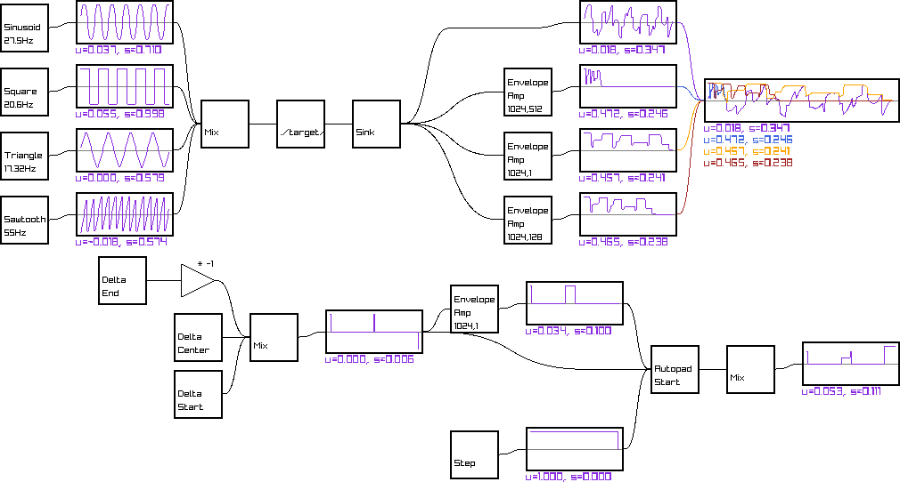

# DSP Blocks

my DSP playground

# Todo List

## Phase 1: Foundational DSP and Audio Processing

### Basic Signal Processing

- [x] Blocks Core
- [x] Vis Core
- [x] Implement and visualize basic waveforms (sine, square, sawtooth)
  - [ ] Implement them using fourier approximation
- [ ] Create interactive controls for frequency, amplitude, and phase
- [ ] Implement signal addition, multiplication, and scaling
- [x] [Visualize envelope detection](https://youtu.be/rlypsap6Wow?list=PL-wATfeyAMNqIee7cH3q1bh4QJFAaeNv0&t=995)
- [ ] Implement Discrete Fourier Transform (DFT) from scratch
- [ ] Visualize frequency spectrum
- [ ] Compare your DFT with numpy's FFT
- [ ] Create interactive spectrogram visualization
- [ ] Implement simple FIR filters (low-pass, high-pass)
- [ ] Visualize filter frequency response
- [ ] Implement convolution from scratch
- [ ] Create interactive filter design tool

### Advanced DSP Concepts

- [ ] Implement common window functions (Hann, Hamming, Blackman)
- [ ] [Extra-wide window functions](https://signalsmith-audio.co.uk/writing/2021/extra-wide-windows/)
- [ ] Visualize their effect on spectral leakage
- [ ] Implement Short-time Fourier Transform (STFT) from scratch
- [ ] Create interactive spectrogram with adjustable window size and overlap
- [ ] Basic implementation of Wavelet transform
- [ ] Visualize time-frequency resolution differences between STFT and Wavelets
- [ ] Implement basic reverberation
- [ ] Create a simple delay effect
- [ ] Visualize stereo signals

## Phase 2: Music-Specific DSP and Feature Extraction

### Music Fundamentals and Low-Level Features

- [ ] Implement autocorrelation-based pitch detection
- [ ] Visualize pitch over time for monophonic audio
- [ ] Implement energy-based onset detection
- [ ] Visualize onset strength function
- [ ] Implement tempo estimation using autocorrelation
- [ ] Visualize beat locations on waveform
- [ ] Compute and visualize Mel-frequency cepstral coefficients (MFCCs)
- [ ] Implement and visualize chromagram

### Advanced Music Features and Analysis

- [ ] Implement chord recognition using template matching
- [ ] Visualize chord progressions
- [ ] Implement novelty-based segmentation
- [ ] Visualize song structure
- [ ] Implement simple harmonic/percussive source separation
- [ ] Visualize separated components
- [ ] Experiment with unsupervised feature learning (e.g., k-means on spectrograms)
- [ ] Visualize learned features

## Phase 3: Machine Learning for Music

### Basic ML Models for Music Tasks

- [ ] Extract features from a dataset (e.g., GTZAN) for genre classification
- [ ] Implement and evaluate simple models (k-NN, Decision Trees) for genre classification
- [ ] Visualize decision boundaries
- [ ] Collect and preprocess a dataset for mood classification
- [ ] Implement and evaluate SVM for mood classification
- [ ] Visualize feature importance
- [ ] Implement a content-based music recommendation system using extracted features
- [ ] Visualize similarity between songs

### Deep Learning for Music

- [ ] Implement a CNN for genre classification using spectrograms
- [ ] Visualize learned filters and feature maps
- [ ] Implement an LSTM for melody generation
- [ ] Visualize generated melodies
- [ ] Implement a simple autoencoder for audio compression
- [ ] Visualize reconstructed spectrograms

## Phase 4: Advanced Topics and Research

### State-of-the-Art Models and Techniques

- [ ] Implement a basic pitch tracking system for music transcription
- [ ] Visualize transcribed notes on a piano roll
- [ ] Experiment with VAEs or GANs for audio generation
- [ ] Visualize the latent space of generated samples
- [ ] Fine-tune a pre-trained model (e.g., VGGish) for a music task
- [ ] Visualize the activation of different layers

## Phase ?: Random topics to implement

### Effects

- [ ] [Waveshapers](https://signalsmith-audio.co.uk/writing/2022/warm-distortion/)
- [ ] [Limiter](https://signalsmith-audio.co.uk/writing/2022/limiter/)
- [ ] [Reverb](https://signalsmith-audio.co.uk/writing/2021/lets-write-a-reverb/)
- [ ] [Signal Stretch](https://signalsmith-audio.co.uk/writing/2023/stretch-design/) [Vid](https://www.youtube.com/watch?v=fJUmmcGKZMI&feature=youtu.be)
- [ ] [Peak-hold](https://signalsmith-audio.co.uk/writing/2022/constant-time-peak-hold/)
- [ ] [Interpolation](https://signalsmith-audio.co.uk/writing/2021/monotonic-smooth-interpolation/)
- [ ] [Box filter](https://signalsmith-audio.co.uk/writing/2021/box-sum-cumulative/)
  - [ ] [Cascaded box-filter smoothing filters](https://signalsmith-audio.co.uk/writing/2022/cascaded-box-filter-smoothing/)
- [ ] [crossfade](https://signalsmith-audio.co.uk/writing/2021/cheap-energy-crossfade/)

### Synthesis

- [ ] [Analytic pluck synthesis](https://signalsmith-audio.co.uk/writing/2021/analytic-pluck/)

### Visualization Stuff

- [ ] Implement a better colored connections
